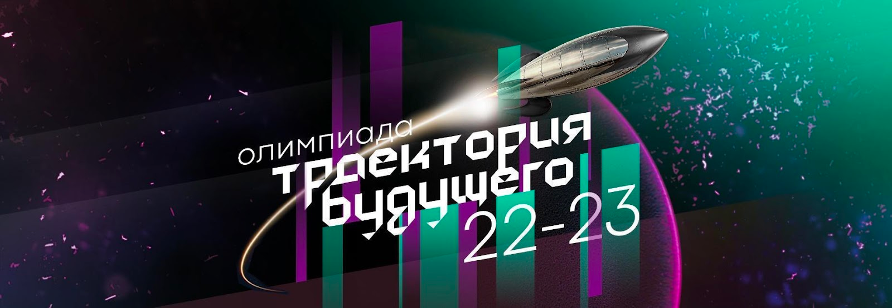

# Задание полуфинала номинации DevOps
На шахматной доске стоят:
- Белый король,
- черный слон,
- черная ладья.

Слон бьет по диагоналям.

Ладья бьет по вертикали и горизонтали

Определить, от какой фигуры есть угроза королю.
Варианты ответа:
- Шах от слона
- Шах от ладьи
- Нет шаха